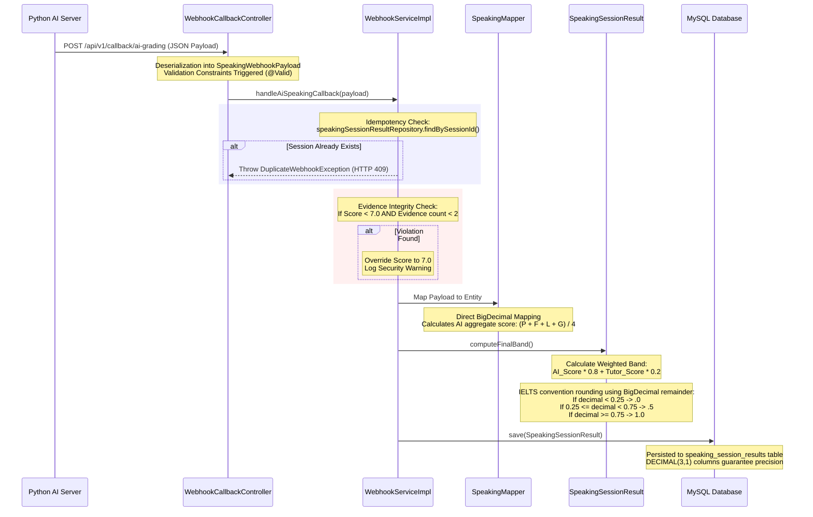

# ENGONOW LMS — Speaking Assessment Manual Testing Guide

This document provides step-by-step instructions for executing manual end-to-end testing scenarios to validate the evidence-based AI speaking assessment pipeline. It includes setup instructions, cURL payloads for edge cases, database verification SQL scripts, and a detailed internal control workflow analysis.

---

## 1. Prerequisites & Environment Setup

Ensure your local development environment is configured properly before running these test scenarios.

### A. Run the Python Mock AI Server
The mock AI server simulates the hybrid grading pipeline (Azure Pronunciation + LLM Lexical/Grammar analysis). Run the server on port `8001` (as expected by the Spring Boot default configuration):

```bash
# Verify Python is installed and run the FastAPI server
python mock_ai_services.py
```
*Note: If you need to manually change the port to `8000` (e.g., for specific staging configurations), run:*
```bash
uvicorn mock_ai_services:app --host 0.0.0.0 --port 8000 --reload
```

### B. Run the Spring Boot Application
Run the main application on port `8080` (it will connect to MySQL and register the webhook endpoints):

```bash
# Compile and start the backend
mvn spring-boot:run
```

---

## 2. cURL Manual Testing Specifications

Use the following cURL commands to test the grading controller logic via Postman, Git Bash, or any command line terminal.

### Scenario A: Successful Grading with Clean Evidences (No Overrides)
This scenario posts a normal AI grading result with a sufficient number of grammar/lexical evidence items. All sub-scores are persisted exactly as received, and the final overall band is computed.

```bash
curl -X POST http://localhost:8080/api/v1/callback/ai-grading \
  -H "Content-Type: application/json" \
  -d '{
    "session_id": "clean_session_999",
    "pronunciation_score": 7.5,
    "fluency_score": 7.5,
    "lexical_score": 7.0,
    "grammar_score": 6.5,
    "evidences": [
      {
        "criterion": "GRAMMAR",
        "quote": "Yesterday I go to the marketplace",
        "error_type": "Verb Tense",
        "correction": "Yesterday I went to the marketplace",
        "explanation": "Used present tense instead of past tense."
      },
      {
        "criterion": "GRAMMAR",
        "quote": "He don\'t care about it",
        "error_type": "Subject-Verb Agreement",
        "correction": "He doesn\'t care about it",
        "explanation": "Subject He requires doesn\'t."
      }
    ],
    "feedback_text": "Excellent grammar improvement shown but minor tense inconsistencies."
  }'
```
**Expected Response:** `HTTP 200 OK`

---

### Scenario B: Evidence Overriding Trigger (Low Score Without Evidence)
This scenario sends an AI-graded grammar score of `6.0` (which is strictly `< 7.0`), but only provides **ONE** citable evidence. Under the system's integrity protection rules, this triggers an automatic override to `7.0` and logs a warning.

```bash
curl -X POST http://localhost:8080/api/v1/callback/ai-grading \
  -H "Content-Type: application/json" \
  -d '{
    "session_id": "override_session_888",
    "pronunciation_score": 7.0,
    "fluency_score": 7.0,
    "lexical_score": 8.0,
    "grammar_score": 6.0,
    "evidences": [
      {
        "criterion": "GRAMMAR",
        "quote": "Yesterday I go to the marketplace",
        "error_type": "Verb Tense",
        "correction": "Yesterday I went to the marketplace",
        "explanation": "Used present tense instead of past tense."
      }
    ],
    "feedback_text": "Grammar needs attention but evidences list is insufficient."
  }'
```
**Expected Response:** `HTTP 200 OK`
*Log Output:* `[WARN] AI penalized grammar score to 6.0 without sufficient citable evidences. Overriding to 7.0`

---

### Scenario C: Triggering the Duplicate Webhook Security Trap
Send the same payload as Scenario A or B twice to trigger the duplicate webhook protection check.

**First Call:**
```bash
curl -X POST http://localhost:8080/api/v1/callback/ai-grading \
  -H "Content-Type: application/json" \
  -d '{
    "session_id": "dup_session_111",
    "pronunciation_score": 7.5,
    "fluency_score": 7.5,
    "lexical_score": 7.0,
    "grammar_score": 7.0,
    "evidences": [],
    "feedback_text": "Deduplication testing payload"
  }'
```
**Expected Response:** `HTTP 200 OK`

**Second Call (Duplicate):**
```bash
curl -X POST http://localhost:8080/api/v1/callback/ai-grading \
  -H "Content-Type: application/json" \
  -d '{
    "session_id": "dup_session_111",
    "pronunciation_score": 7.5,
    "fluency_score": 7.5,
    "lexical_score": 7.0,
    "grammar_score": 7.0,
    "evidences": [],
    "feedback_text": "Deduplication testing payload duplicate"
  }'
```
**Expected Response:** `HTTP 409 Conflict` (Duplicate Webhook Exception thrown)

---

## 3. Database Verification Inquiries (SQL)

To confirm that `BigDecimal` values are stored with correct precision (`precision = 3, scale = 1`) and verify the result structure in MySQL, connect to your MySQL database and run the following queries:

### Check Schema Definition for Precision
```sql
DESCRIBE speaking_session_results;
```
*Verify that `pronunciation_score`, `fluency_score`, `lexical_score`, `grammar_score`, and `overall_band` have the type `decimal(3,1)`.*

### Retrieve Saved Session Results
```sql
SELECT 
    id, 
    booking_id, 
    session_id, 
    pronunciation_score, 
    fluency_score, 
    lexical_score, 
    grammar_score, 
    ai_score, 
    overall_band, 
    is_complete 
FROM speaking_session_results 
WHERE session_id IN ('clean_session_999', 'override_session_888', 'dup_session_111');
```

---

## 4. Internal Control Workflow Analysis

The diagram below details the step-by-step progression of speaking callback data:


