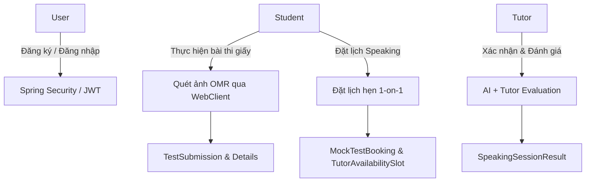

# ENGONOW Smart LMS – MVP Backend

**ENGONOW Smart LMS** là hệ thống quản lý học tập thông minh (Learning Management System) chuyên biệt cho việc ôn luyện IELTS. Dự án tập trung giải quyết các bài toán cốt lõi về kiểm tra đánh giá chất lượng học viên thông qua hai giải pháp: tự động chấm điểm bài thi trắc nghiệm (Reading/Listening) bằng công nghệ quét ảnh OMR (Optical Mark Recognition) và đánh giá kỹ năng Speaking kết hợp giữa trí tuệ nhân tạo (AI) cùng thang điểm chấm của giáo viên (Tutor Rubric).

---

## 🚀 Công Nghệ Sử Dụng (Tech Stack)

Hệ thống được phát triển trên nền tảng Java hiện đại, tối ưu hóa hiệu năng truy vấn dữ liệu và khả năng xử lý bất đồng bộ:

*   **Core Framework:** Spring Boot 3.2.5 & Java 17
*   **Database & ORM:** MySQL, Spring Data JPA, Hibernate 6
*   **Security:** Spring Security & JWT (JSON Web Token) bằng thư viện `jjwt 0.11.5`
*   **Mappers & Utility:** MapStruct 1.5.5.Final & Lombok 1.18.32
*   **Integrations:**
    *   **Spring Webflux (WebClient):** Giao tiếp bất đồng bộ phi chặn (non-blocking) với OMR Service.
    *   **Cloudinary:** Lưu trữ và quản lý ảnh phiếu làm bài (answer sheet) của học viên.
    *   **Spring Mail:** Gửi thông báo kết quả thi, lịch hẹn tự động qua email.

---

## 🏛️ Kiến Trúc Hệ Thống & Thiết Kế Nghiệp Vụ

Dự án được thiết kế chuẩn chỉnh theo mô hình Domain-Driven Design (DDD) thu nhỏ với các quy tắc ràng buộc chặt chẽ tại tầng Database nhằm đảm bảo tính toàn vẹn dữ liệu:



### 1. Phân Hệ Đăng Ký & Xác Thực (User & Authentication)
*   **Quản lý phân quyền (RBAC):** Gồm 3 vai trò chính: `STUDENT` (Học viên), `TEACHER` (Giáo viên/Tutor), và `ADMIN` (Quản trị viên).
*   **Bảo mật thông tin:** Mật khẩu được mã hóa một chiều bằng thuật toán **BCrypt** trước khi lưu trữ xuống Database. Trường `email` và `username` cấu hình ràng buộc `UNIQUE` ở mức cơ sở dữ liệu để ngăn chặn trùng lặp.
*   **Lazy Loading:** Mối quan hệ giữa `User` và `Role` sử dụng `@ManyToMany(fetch = FetchType.LAZY)` để tránh tình trạng tải thừa dữ liệu không mong muốn (N+1 query) khi truy vấn thông tin cơ bản của User.

### 2. Hệ Thống Chấm Điểm Tự Động Qua Ảnh Chụp (OMR Exam Auto-Grading)
*   Học viên làm bài kiểm tra Reading/Listening trên phiếu trắc nghiệm giấy và chụp ảnh tải lên hệ thống.
*   Hệ thống tải ảnh lên dịch vụ Cloudinary, lấy URL và gửi yêu cầu xử lý bất đồng bộ tới OMR Service (Python/FastAPI hoặc dịch vụ OCR chuyên biệt).
*   **Auto-Grading:** Sau khi nhận kết quả tọa độ các ô tô từ OMR Service, hệ thống tự động đối chiếu các câu trả lời (`SubmissionDetail`) với đáp án mẫu (`AnswerKey`) của đề thi (`Exam`), ghi nhận kết quả đúng/sai và tính toán tổng số điểm/phần trăm hoàn thành tại thực thể `TestSubmission`.

### 3. Đặt Lịch Hẹn Học Speaking Với Cơ Chế Concurrency Control
Để xử lý bài toán **nhiều học viên đặt cùng một khung giờ trống** (Tutor Availability Slot) tại cùng một thời điểm, hệ thống áp dụng cơ chế **Optimistic Locking (Khóa lạc quan)**:
*   Sử dụng thuộc tính `@Version` (trường `version` kiểu `Integer`) trên thực thể `TutorAvailabilitySlot`.
*   Khi có hai giao dịch (Transaction) đồng thời cập nhật trạng thái của cùng một Slot từ `AVAILABLE` sang `BOOKED`:
    1.  Transaction 1 thực hiện thành công, phiên bản (`version`) của slot tăng từ `0` lên `1`.
    2.  Transaction 2 kiểm tra phiên bản lúc bắt đầu thấy `0` nhưng khi cập nhật thì phiên bản thực tế đã là `1`. Cập nhật thất bại (0 rows affected).
    3.  Hibernate lập tức ném ra ngoại lệ `OptimisticLockException`. Tầng Service sẽ bắt ngoại lệ này và phản hồi mã lỗi `HTTP 409 Conflict` yêu cầu học viên chọn slot khác.
*   *Lý do lựa chọn:* Tránh việc khóa cứng dòng dữ liệu (Pessimistic Locking) gây tắc nghẽn Database và giảm hiệu năng hệ thống khi lượng người dùng đồng thời tăng cao.

### 4. Đánh Giá Kỹ Năng Speaking Kết Hợp (Hybrid Speaking Assessment)
Học viên thực hiện bài nói trực tuyến và được đánh giá theo công thức kết hợp tối ưu:
$$\text{Final Band} = (\text{AI Score} \times 0.8) + (\text{Average Tutor Score} \times 0.2)$$
*   **AI Grading (Chiếm 80%):** Chấm tự động qua ghi âm bài nói, chấm theo thang điểm chuẩn IELTS từ 0-9. Nhận kết quả thông qua một webhook callback bất đồng bộ. Thiết kế sử dụng thuộc tính `sessionId` làm khóa duy nhất (`unique constraint`) để lọc trùng lặp và đảm bảo tính **Idempotency** (chống xử lý trùng lặp khi webhook gửi lại nhiều lần).
*   **Tutor Rubric (Chiếm 20%):** Giáo viên đánh giá chi tiết theo 4 tiêu chí chuẩn IELTS:
    1.  *Fluency and Coherence* (Độ trôi chảy và mạch lạc)
    2.  *Lexical Resource* (Vốn từ vựng)
    3.  *Grammatical Range and Accuracy* (Sự đa dạng và chính xác ngữ pháp)
    4.  *Pronunciation* (Phát âm)
*   **IELTS Rounding Rule:** Điểm số cuối cùng (`finalBand`) sau khi tổng hợp sẽ tự động được làm tròn về mức `.0` hoặc `.5` gần nhất theo quy chuẩn chấm điểm IELTS của IDP/BC (ví dụ: `6.25` -> `6.5`, `6.15` -> `6.0`).

---

## 🛠️ Thiết Kế Cơ Sở Dữ Liệu & Tối Ưu Hóa Hiệu Năng (Performance Optimization)

Dự án chú trọng áp dụng các thực tế tốt nhất (Best Practices) trong tối ưu hóa cơ sở dữ liệu và Spring JPA:

1.  **Tránh Lỗi N+1 Với `JOIN FETCH`:**
    Tại `ExamRepository`, phương thức `findByIdWithAnswerKeys` sử dụng truy vấn JPQL tùy chỉnh kết hợp `JOIN FETCH` để tải thông tin của `Exam` và danh sách toàn bộ `AnswerKey` đi kèm chỉ trong **1 câu lệnh SQL duy nhất**.
2.  **Khử Chuẩn Hóa Dữ Liệu Hợp Lý (Denormalization):**
    *   Lưu trữ trực tiếp trường `total_questions` ở bảng `exams` để hiển thị danh sách nhanh chóng mà không cần chạy truy vấn `COUNT` hoặc `JOIN` sang bảng `answer_keys`.
    *   Lưu trữ kết quả tính toán `score` và `percentage` trực tiếp trên bảng `test_submissions` sau khi chấm thi để tối ưu hóa hiệu năng hiển thị báo cáo.
3.  **Tắt OSIV (Open Session In View):**
    Cấu hình `spring.jpa.open-in-view: false` trong `application.yml`. Điều này bắt buộc mọi kết nối tới cơ sở dữ liệu phải được giải phóng ngay sau khi kết thúc tầng Transaction/Service, tránh rò rỉ kết nối (connection leaks) và ngăn chặn việc gọi các truy vấn lazy-load phát sinh ngoài ý muốn tại tầng Controller.
4.  **Bật JDBC Batching:**
    Cấu hình batch-size là `25` cho các tác vụ thêm mới/cập nhật hàng loạt (bulk inserts/updates) như khi tạo đề thi mới với hàng chục câu hỏi hoặc lưu chi tiết bài làm học viên:
    ```yaml
    spring:
      jpa:
        properties:
          hibernate:
            jdbc:
              batch_size: 25
              batch_versioned_data: true
            order_inserts: true
            order_updates: true
    ```
5.  **Thiết Lập Chỉ Mục (Database Indexing):**
    Đánh chỉ mục thông minh trên các cột thường xuyên tìm kiếm hoặc sắp xếp như: `student_id` và `exam_id` trên bảng `test_submissions`, `teacher_id` và `status` trên bảng `tutor_availability_slots`.

---

## 📂 Cấu Trúc Thư Mục Dự Án

```text
engonow-lms/
├── src/
│   ├── main/
│   │   ├── java/com/engonow/lms/
│   │   │   ├── config/             # Cấu hình WebClient, Async Executor, JPA Auditing
│   │   │   ├── entity/             # Các thực thể dữ liệu (JPA Entities)
│   │   │   ├── enums/              # Các định nghĩa kiểu Enum (RoleName, SlotStatus,...)
│   │   │   ├── repository/         # Tầng giao tiếp cơ sở dữ liệu (Spring Data JPA)
│   │   │   └── EngoNowLmsApplication.java # Class khởi chạy Spring Boot chính
│   │   └── resources/
│   │       └── application.yml     # Cấu hình môi trường, DB, Mail, Async, WebClient
└── pom.xml                         # Quản lý thư viện Maven dependencies
```

---

## 🛠️ Hướng Dẫn Khởi Chạy Dự Án (Getting Started)

### 📋 Yêu Cầu Hệ Thống (Prerequisites)
*   **Java Development Kit (JDK):** Phiên bản 17 trở lên.
*   **Maven:** Phiên bản 3.8+ để quản lý và đóng gói dự án.
*   **Database:** MySQL Server 8.0+.

### ⚙️ Biến Môi Trường Cần Thiết (Environment Variables)
Trước khi chạy ứng dụng, vui lòng thiết lập các biến môi trường sau hoặc cập nhật trực tiếp cấu hình trong `application.yml`:

| Tên biến | Mô tả | Giá trị mặc định |
| :--- | :--- | :--- |
| `DB_USERNAME` | Tên đăng nhập cơ sở dữ liệu MySQL | `root` |
| `DB_PASSWORD` | Mật khẩu cơ sở dữ liệu MySQL | `secret` |
| `JWT_SECRET` | Khóa bí mật dùng để mã hóa mã thông báo JWT | *Tự sinh chuỗi Hex 256-bit* |
| `MAIL_HOST` | Địa chỉ máy chủ SMTP gửi mail | `smtp.gmail.com` |
| `MAIL_PORT` | Cổng kết nối gửi mail của SMTP | `587` |
| `MAIL_USERNAME` | Email gửi thư hệ thống | `noreply@engonow.com` |
| `MAIL_PASSWORD` | Mật khẩu ứng dụng (App Password) của email gửi | `(Trống)` |
| `CLOUDINARY_CLOUD_NAME` | Tên tài khoản lưu trữ Cloudinary | `demo` |
| `CLOUDINARY_API_KEY` | API Key kết nối Cloudinary | `(Trống)` |
| `CLOUDINARY_API_SECRET`| API Secret kết nối Cloudinary | `(Trống)` |
| `OMR_SERVICE_URL` | Đường dẫn kết nối tới API chấm điểm OMR | `http://localhost:8001` |
| `WEBHOOK_SECRET` | Khóa xác thực webhook từ AI Speaking Service | `engonow-webhook-secret-2024` |

### 🏃 Chạy Ứng Dụng
1.  **Tạo Cơ Sở Dữ Liệu:**
    Tạo một database trống trên MySQL Server với tên `engonow_lms`:
    ```sql
    CREATE DATABASE engonow_lms CHARACTER SET utf8mb4 COLLATE utf8mb4_unicode_ci;
    ```
2.  **Biên dịch & Đóng gói:**
    ```bash
    mvn clean package -DskipTests
    ```
3.  **Khởi chạy ứng dụng:**
    ```bash
    mvn spring-boot:run
    ```
    Hệ thống sẽ khởi chạy và lắng nghe tại cổng mặc định `8080`. Bạn có thể truy cập qua địa chỉ `http://localhost:8080`.
