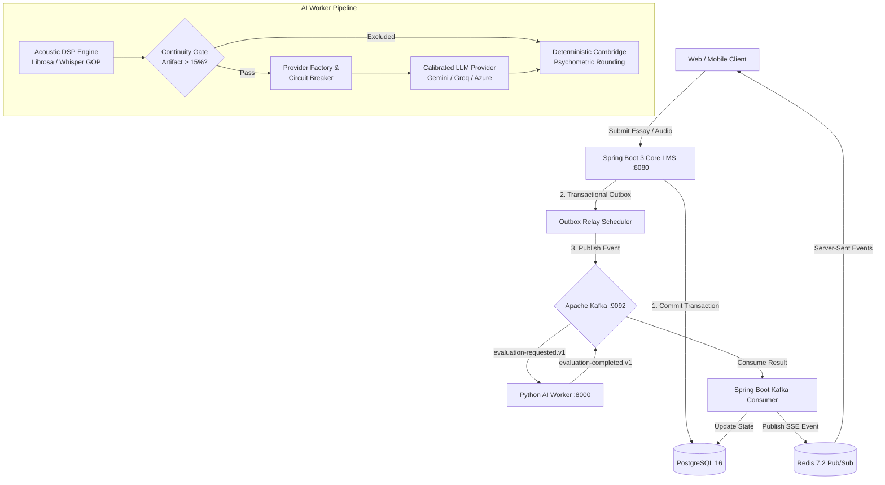

# ENGONOW Smart LMS – Enterprise IELTS Assessment Platform

[](https://www.oracle.com/java/)
[](https://spring.io/projects/spring-boot)
[](https://www.python.org/)
[](https://fastapi.tiangolo.com/)
[](https://kafka.apache.org/)
[](https://www.postgresql.org/)
[](https://redis.io/)

**ENGONOW Smart LMS** is an enterprise-grade, distributed AI assessment platform for IELTS Writing and Speaking. It integrates a transactional Spring Boot core orchestrator, asynchronous Kafka event streaming, an acoustic DSP signal processing pipeline, and calibrated multi-provider LLMs (Google Gemini 2.5 Flash, Groq LLaMA 3.3 70B, Azure OpenAI GPT-4o) with deterministic Cambridge psychometric rounding.

---

## 📚 Official Enterprise Handover Suite

All technical architecture, API contracts, deployment instructions, and operational runbooks are centrally maintained in `docs/handover/`:

| Document | Description | Path |
|---|---|---|
| **Architecture Guide** | Distributed topology, transactional outbox/inbox, circuit breaker, & acoustic DSP | [`docs/handover/ARCHITECTURE_GUIDE.md`](docs/handover/ARCHITECTURE_GUIDE.md) |
| **Architecture Decision Log** | ADR records for Kafka, Pydantic v2, CUSUM SPC, and Cambridge rounding | [`docs/handover/ARCHITECTURE_DECISION_LOG.md`](docs/handover/ARCHITECTURE_DECISION_LOG.md) |
| **API Contract (OpenAPI 3.1)** | Canonical REST, SSE events, Webhooks, and Admin endpoints specification | [`docs/handover/API_CONTRACT.yaml`](docs/handover/API_CONTRACT.yaml) |
| **Deployment Guide** | Multi-stage Dockerfiles, Docker Compose topology, Flyway migrations, & security | [`docs/handover/DEPLOYMENT_GUIDE.md`](docs/handover/DEPLOYMENT_GUIDE.md) |
| **Runbook & Playbooks** | SEV-1/SEV-2 incident triage, DLQ recovery, CUSUM drift hold, & disaster recovery | [`docs/handover/RUNBOOK.md`](docs/handover/RUNBOOK.md) |
| **Calibration Guide** | Golden Corpus benchmarking, CUSUM drift monitoring, and Gatekeeper promotions | [`docs/handover/CALIBRATION_GUIDE.md`](docs/handover/CALIBRATION_GUIDE.md) |
| **Known Limitations** | Code-grounded analysis of ASR drift, DSP compute limits, and mitigation roadmap | [`docs/handover/KNOWN_LIMITATIONS.md`](docs/handover/KNOWN_LIMITATIONS.md) |
| **Test Verification Report** | Automated test matrix, code coverage, performance benchmarks, and cert sign-off | [`docs/handover/TEST_REPORT.md`](docs/handover/TEST_REPORT.md) |

---

## 🏛️ Platform Architecture Overview



### Core Subsystems

1. **Transactional Reliability Layer (Spring Boot 3)**:
   - Transactional Outbox pattern guarantees at-least-once message dispatch to Kafka without dual-write hazards.
   - Idempotent Inbox consumer prevents duplicate processing on at-least-once deliveries.
   - Real-time SSE streaming via Redis Pub/Sub for sub-second status updates to clients.

2. **Multi-Modal Acoustic DSP & Scoring Engine (Python 3.10)**:
   - Zero-external-API acoustic analysis (speech rate, mean phonation time, pause distribution, GOP phonetic posteriors).
   - Technical discontinuity gate (< 15% artifact ratio) short-circuits corrupted audio to protect LLM quota and flag for human review.

3. **Multi-Provider LLM Evaluation Layer**:
   - Provider factory with dynamic routing across Google Gemini 2.5 Flash, Groq LLaMA 3.3 70B, and Azure OpenAI GPT-4o.
   - In-memory circuit breakers with exponential backoff and automatic failover.
   - Strict Pydantic v2 contract enforcement and prompt caching.

4. **Deterministic Psychometric Rounding**:
   - Both Java (`CambridgeRoundingUtil.java`) and Python (`providers/rounding.py`) execute strict Cambridge English Language Assessment rounding rules using `decimal.Decimal` with `ROUND_HALF_UP`.

5. **MLOps Calibration & Telemetry**:
   - CUSUM Statistical Process Control (SPC) detects model scoring drift and initiates automated drift-holds when upper/lower control limits are breached.
   - Prometheus metrics endpoint (`/metrics`) and comprehensive health checks (`/health`).

---

## 🚀 Quick Start & Local Execution

### Prerequisites
- **Java**: OpenJDK 17+
- **Python**: Python 3.10+
- **Docker & Docker Compose**: v2.20+
- **Maven**: 3.8+

### 1. Run Full Production Stack with Docker Compose
```bash
# Copy and configure environment variables
cp .env.example .env

# Launch all infrastructure and application services
docker compose -f docker-compose.prod.yml up -d --build

# Verify running health
curl -f http://localhost:8080/actuator/health
curl -f http://localhost:8000/health
```

### 2. Run Local Development Services
```bash
# Start infrastructure dependencies (PostgreSQL, Kafka, Redis)
docker compose -f docker-compose.kafka.yml up -d

# Start Spring Boot Core LMS
mvn spring-boot:run

# Start Python AI Worker (in separate terminal)
venv\Scripts\activate   # Or source venv/bin/activate on Linux
uvicorn ai_worker:app --host 0.0.0.0 --port 8000 --reload
```

---

## 🧪 Verification & Regression Testing

Execute the comprehensive test suites across both runtimes:

```bash
# 1. Run full Python test suite (109 tests, 100% PASS)
venv\Scripts\python -m unittest discover -s tests -p "test_*.py"

# 2. Run full Java test suite (117 tests, 100% PASS)
mvn test

# 3. Verify Handover Documentation & Dockerfile packaging integrity
venv\Scripts\python scripts/verify_handover_package.py

# 4. Run sample Speaking assessment demonstration
venv\Scripts\python run_speaking_assessment.py
```

---

## 🛡️ License & Compliance
Proprietary & Confidential. Copyright © 2026 ENGONOW Smart LMS. All rights reserved.
