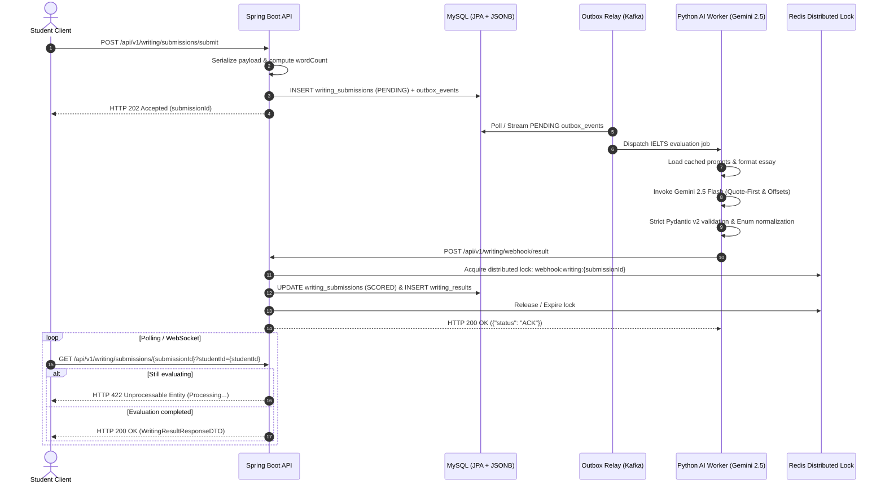

# IELTS AI Writing Subsystem — Integration & Frontend Handover Guide

> **Document Version:** 1.0.0  
> **API Version:** v1  
> **Target Audience:** Frontend Engineers (React/Next.js/Mobile), Backend Engineers, QA Engineers.

---

## 1. System Architecture & Asynchronous Lifecycle

The IELTS AI Writing Subsystem operates on an **event-driven, asynchronous evaluation pipeline** designed to handle high concurrency while preventing blocking I/O and database deadlocks.



---

## 2. API Quick Reference & Sample cURL

### 2.1. Submit Essay for Grading
* **Endpoint:** `POST /api/v1/writing/submissions/submit`
* **Status Code:** `202 Accepted`

```bash
curl -X POST "https://api.engonow.com/api/v1/writing/submissions/submit" \
  -H "Content-Type: application/json" \
  -H "Authorization: Bearer <JWT_TOKEN>" \
  -d '{
    "studentId": "a2effcb1-77d8-41a3-b6e1-73c4f60219c5",
    "taskType": "TASK2",
    "taskPrompt": "Some people believe that unpaid community service should be a compulsory part of high school programmes. To what extent do you agree or disagree?",
    "essayText": "In recent years, community work has gained significant attention. Working from home bring more benefits to many employees who want to spend effective time for their work and their own..."
  }'
```

#### Response (`202 Accepted`):
```json
{
  "submissionId": "9b1deb4d-3b7d-4bad-9bdd-2b0d7b3dcb6d",
  "studentId": "a2effcb1-77d8-41a3-b6e1-73c4f60219c5",
  "taskType": "TASK2",
  "status": "PENDING",
  "wordCount": 285,
  "createdAt": "2026-08-14T14:30:00Z"
}
```

---

### 2.2. Poll / Query Assessment Result
* **Endpoint:** `GET /api/v1/writing/submissions/{submissionId}?studentId={studentId}`
* **Status Code:** `200 OK` (when scored) / `422 Unprocessable Entity` (while pending)

```bash
curl -X GET "https://api.engonow.com/api/v1/writing/submissions/9b1deb4d-3b7d-4bad-9bdd-2b0d7b3dcb6d?studentId=a2effcb1-77d8-41a3-b6e1-73c4f60219c5" \
  -H "Authorization: Bearer <JWT_TOKEN>"
```

#### Response (`200 OK`):
```json
{
  "resultId": "4c58d042-4f35-430b-a19f-d31e9c5f0f3e",
  "submissionId": "9b1deb4d-3b7d-4bad-9bdd-2b0d7b3dcb6d",
  "taskType": "TASK2",
  "status": "SCORED",
  "taskAchievementScore": 7.0,
  "coherenceCohesionScore": 7.0,
  "lexicalResourceScore": 7.0,
  "grammaticalRangeScore": 7.0,
  "overallBand": 7.0,
  "evaluatedBy": "AI",
  "feedbackDetail": {
    "examinerSummary": "A well-structured argumentative essay reaching Band 7.0 with fully developed core premises.",
    "essayMetrics": {
      "totalWords": 285,
      "uniqueWords": 142,
      "lexicalDiversityRatio": 0.498,
      "averageSentenceLength": 19.0,
      "complexSentencesRatio": 0.65
    },
    "criteria": [
      {
        "criterion": "TASK_RESPONSE",
        "score": 7.0,
        "summary": "All prompt components addressed with a sustained stance throughout the response.",
        "strengths": ["Clear position established in introduction"],
        "weaknesses": ["Supporting evidence in body 2 could be extended with concrete examples"],
        "bandGapAnalysis": "Extend supporting examples for Band 8.0."
      },
      {
        "criterion": "COHERENCE_COHESION",
        "score": 7.0,
        "summary": "Logical progression across paragraphs.",
        "strengths": ["Good discourse markers"],
        "weaknesses": ["Minor repetitive connector usage in paragraph 3"]
      },
      {
        "criterion": "LEXICAL_RESOURCE",
        "score": 7.0,
        "summary": "Precise vocabulary with minor collocation slips.",
        "strengths": ["Academic lexicon"],
        "weaknesses": ["Occasional unnatural collocation"]
      },
      {
        "criterion": "GRAMMATICAL_RANGE_ACCURACY",
        "score": 7.0,
        "summary": "Good mix of complex clauses with high accuracy.",
        "strengths": ["Compound and complex structures"],
        "weaknesses": ["One minor subject-verb agreement lapse"]
      }
    ],
    "corrections": [
      {
        "startIndex": 45,
        "endIndex": 85,
        "originalSentence": "working from home bring more benefits",
        "correctedSentence": "working from home brings more benefits",
        "errorType": "GRAMMAR",
        "severity": "MAJOR",
        "explanation": "'Working from home' là danh động từ làm chủ ngữ số ít, do đó động từ phải chia là 'brings'.",
        "enhancedOptions": {
          "band7Option": "telecommuting yields considerable advantages for modern workforces",
          "band8Option": "remote working models offer distinct operational efficiencies and personal autonomy"
        }
      }
    ],
    "cohesiveDeviceAnalysis": {
      "usedDevices": ["In conclusion", "On the other hand", "Furthermore"],
      "overusedOrRepetitive": ["Furthermore"],
      "suggestedTransitions": ["Additionally", "Moreover"]
    },
    "vocabularyUpgrades": [
      {
        "originalWord": "good",
        "contextInEssay": "a good idea for workers",
        "academicAlternatives": ["advantageous", "beneficial", "viable"],
        "recommendedCollocations": ["prove advantageous", "highly beneficial"]
      }
    ],
    "improvementTips": [
      {
        "category": "COHERENCE_COHESION",
        "tipText": "Đa dạng hóa các liên từ chuyển đoạn để tránh cảm giác liên kết cơ học ở đầu mỗi đoạn thân bài.",
        "targetBand": 8.0
      }
    ]
  },
  "createdAt": "2026-08-14T14:30:05Z",
  "updatedAt": "2026-08-14T14:30:12Z"
}
```

---

## 3. Frontend UI/UX Rendering Specifications

### 3.1. Interactive In-Text Correction Highlighter (Character Offsets)
The AI engine provides exact `[startIndex, endIndex)` 0-indexed character offsets for the original essay text.

#### Implementation Pattern (React / TypeScript):
```tsx
interface Span {
  start: number;
  end: number;
  correction?: SentenceCorrection;
}

export function renderHighlightedEssay(essayText: string, corrections: SentenceCorrection[]) {
  // Sort corrections ascending by startIndex
  const sorted = [...corrections].sort((a, b) => a.startIndex - b.startIndex);
  
  const elements: JSX.Element[] = [];
  let cursor = 0;

  sorted.forEach((corr, index) => {
    // 1. Unflagged text preceding correction
    if (corr.startIndex > cursor) {
      elements.push(<span key={`text-${cursor}`}>{essayText.slice(cursor, corr.startIndex)}</span>);
    }

    // 2. Flagged error span with severity styling
    const errorText = essayText.slice(corr.startIndex, corr.endIndex);
    elements.push(
      <mark
        key={`error-${corr.startIndex}-${corr.endIndex}`}
        className={`cursor-pointer rounded px-1 transition-colors ${getSeverityBadgeStyle(corr.severity)}`}
        onClick={() => setSelectedCorrection(corr)}
      >
        {errorText}
      </mark>
    );

    cursor = corr.endIndex;
  });

  // 3. Trailing text after final correction
  if (cursor < essayText.length) {
    elements.push(<span key={`text-${cursor}`}>{essayText.slice(cursor)}</span>);
  }

  return <div className="leading-relaxed font-serif text-lg">{elements}</div>;
}
```

### 3.2. Error Severity & Badge Taxonomy
Map the `severity` field to UI badges:
* **`CRITICAL`** (Red `#EF4444` / `bg-red-100 text-red-800`): Factual reversal, complete off-topic premise, severe structural breakage.
* **`MAJOR`** (Orange `#F59E0B` / `bg-amber-100 text-amber-800`): Subject-verb agreement, repetitive discourse marker cap, wrong word formation.
* **`MINOR`** (Blue `#3B82F6` / `bg-blue-100 text-blue-800`): Minor punctuation slip, slight register refinement.

### 3.3. Band-Boosting Paraphrases Accordion (`EnhancedOptions`)
When a student clicks on a highlighted sentence, render a side drawer or popup displaying:
1. **Current Error & Vietnamese Rationale** (`explanation`).
2. **Band 7.0 Upgrade Option** (`band7Option`): Natural academic syntax suitable for Band 7.
3. **Band 8.0+ Upgrade Option** (`band8Option`): High-precision, native collocation suitable for Band 8+.

---

## 4. Error Codes & Exception Mapping

| HTTP Code | Exception Name | Scenario / Cause |
| :--- | :--- | :--- |
| `400 Bad Request` | `MethodArgumentNotValidException` | Blank prompt/essay or missing fields in request body. |
| `404 Not Found` | `WritingSubmissionNotFoundException` | Specified `submissionId` or `studentId` does not exist. |
| `409 Conflict` | `ConcurrencyFailureException` / Redis Lock Rejection | Duplicate concurrent webhook or race condition on the same submission. |
| `422 Unprocessable Entity` | `WritingSubmissionProcessingException` | Result requested before AI evaluation has completed (`status == PENDING`). |
| `500 Internal Server Error` | `Exception` | Unhandled system exception or database connection error. |
