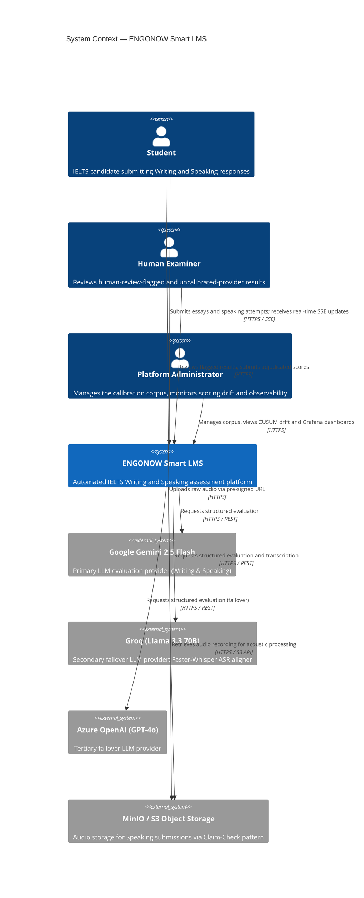
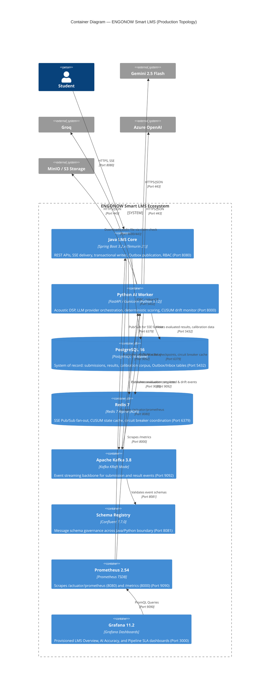
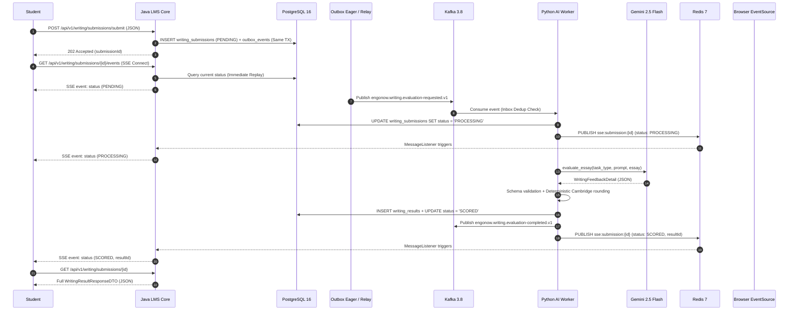
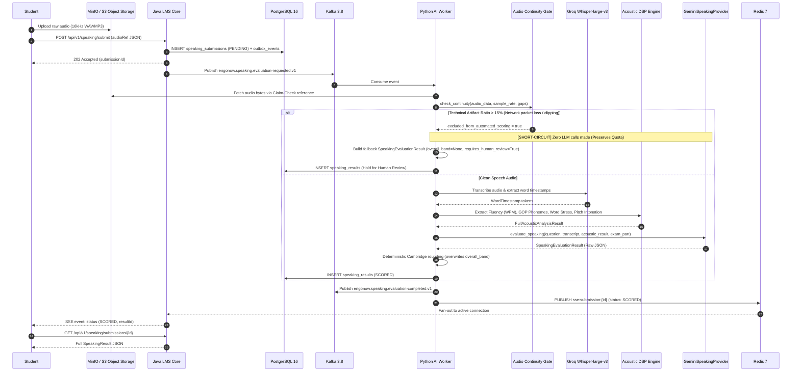

# ARCHITECTURE_GUIDE.md — ENGONOW Smart LMS

> **Document status:** Verified Ground Truth (Sprint 4 — Production Release v1.0). Fully audited against active Java LMS Core (Spring Boot 3.2.x) and Python AI Worker (FastAPI / Acoustic DSP Engine) codebases.

---

## 1. Executive Summary

ENGONOW Smart LMS provides automated IELTS Writing and Speaking assessment built on a **deterministic-scoring principle**: AI providers perform qualitative extraction (error identification, acoustic feature interpretation, structured feedback generation) while numerical scoring (band calculation, Cambridge rounding, penalty and ceiling rules) is enforced exclusively in application code, never delegated to LLM arithmetic. 

Evaluation executes asynchronously through an event-driven pipeline spanning a Java core service and a Python AI worker, with results delivered to learners in real time via Server-Sent Events backed by Redis Pub/Sub. A continuous calibration and statistical drift-monitoring subsystem maintains scoring accuracy (target Overall Band MAE $\le 0.50$) against a human-rated Golden Corpus, with two-sided CUSUM control detecting degradation or data contamination before either reaches production scale.

---

## 2. System Context (C4 Level 1)



| Actor / External System | Relationship to ENGONOW |
|---|---|
| **Student** | Primary user; submits Writing essays and Speaking audio references, consumes live updates via SSE |
| **Human Examiner** | Reviews attempts flagged for mandatory review (underlength response, acoustic dropout, uncalibrated fallback scores, or active CUSUM drift hold) |
| **Platform Administrator** | Operates the calibration corpus (intake, rating, adjudication, Gatekeeper runs), monitors Prometheus metrics and Grafana dashboards |
| **Gemini 2.5 Flash** | Primary evaluation provider for both Writing (`GEMINI_WRITING`) and Speaking (`GEMINI_2_5_FLASH_SPEAKING`) |
| **Groq (Llama 3.3 70B)** | Secondary failover LLM provider; hosts Whisper-large-v3 for Speaking transcription and word-level alignment |
| **Azure OpenAI (GPT-4o)** | Tertiary failover LLM provider |
| **MinIO / AWS S3** | Object storage housing candidate audio recordings (`engonow-audio-recordings` bucket) |

---

## 3. Container Architecture (C4 Level 2)



### Production Service Inventory (`docker-compose.prod.yml`)

| Service | Container Name | Base Image / Build | Port | Healthcheck & Role |
|---|---|---|:---:|---|
| **`postgres`** | `engonow-postgres` | `postgres:16-alpine` | `5432` | `pg_isready`: Relational DB with Flyway migrations V3–V7. |
| **`redis`** | `engonow-redis` | `redis:7-alpine` | `6379` | `redis-cli ping`: AOF-enabled; Redis Pub/Sub for SSE; CUSUM state store. |
| **`kafka`** | `engonow-kafka` | `apache/kafka:3.8.0` | `9092` | `kafka-broker-api-versions.sh`: KRaft mode (zero ZooKeeper); partition backbone. |
| **`schema-registry`** | `engonow-schema-registry` | `confluentinc/cp-schema-registry:7.7.0` | `8081` | `curl /subjects`: Cross-language event schema validation. |
| **`lms-core`** | `engonow-lms-core` | `Dockerfile.lms-core` (Temurin 21) | `8080` | `wget /health`: Spring Boot 3.2 backend; Outbox relay, SSE controller. |
| **`ai-worker`** | `engonow-ai-worker` | `Dockerfile.ai-worker` (Python 3.12) | `8000` | `urllib /health`: FastAPI worker; Acoustic DSP & LLM provider evaluation. |
| **`prometheus`** | `engonow-prometheus` | `prom/prometheus:v2.54.0` | `9090` | Scrapes JVM Micrometer & Python Prometheus multiproc metrics. |
| **`grafana`** | `engonow-grafana` | `grafana/grafana:11.2.0` | `3000` | Visualization for 3 canonical dashboards (LMS Core, AI Worker, Pipeline SLA). |

---

## 4. Key Architectural Patterns

### 4.1 Transactional Outbox & Inbox Deduplication
Dual-write consistency between PostgreSQL and Kafka is guaranteed through the Transactional Outbox pattern:
1. **Atomic Write**: In `WritingSubmissionServiceImpl.java`, the domain entity (`WritingSubmission`) and the `OutboxEvent` are written within a single `@Transactional` local database transaction.
2. **Two-Stage Relay**:
   - **Eager Dispatch**: Immediately after database transaction commit, `OutboxEagerDispatcherListener` (`@TransactionalEventListener(phase = TransactionPhase.AFTER_COMMIT)`) attempts low-latency dispatch to Kafka.
   - **Reconciliation Backstop**: `OutboxRelayScheduler.java` runs on a scheduled fixed-delay sweep (`fixedDelay = 10000ms`, batch size $50$), polling orphan `PENDING` outbox records where `created_at < NOW() - 5s` and retrying up to 3 times before marking `FAILED`.
3. **Inbox Pattern Deduplication**:
   - On the consumer side (`SpeakingEvaluationConsumer.java` & Java `SpeakingResultListener.java`), idempotency keys are acquired atomically via `inbox_events` (`V5__create_java_inbox_events_table.sql`). Duplicate messages are safely committed and dropped.

### 4.2 Multi-Provider Resilience & Failover Routing
LLM evaluation calls are protected by a stateful Circuit Breaker State Machine (`providers/resilience/circuit_breaker.py`):
- **CLOSED**: Traffic flows unimpeded. Rolling 20-call window. `QUOTA_EXHAUSTED` (HTTP 429) triggers an immediate **hard trip** to `OPEN`. Timeouts and 5xx errors trigger a **soft trip** if failure rate exceeds 50% across a minimum 10-call sample.
- **OPEN**: Requests fail fast without hitting the degraded provider. Exponential backoff reset timeout starts at 30s, doubling up to 300s.
- **HALF_OPEN**: Supervised synthetic canary execution (1 single test prompt). Upon canary success, live traffic ramps $10\% \to 50\% \to 100\%$. If any step failure rate exceeds 10%, the circuit reverts to `OPEN`.
- **Intelligent Provider Selector (`providers/resilience/provider_selector.py`)**:
  - Dynamically scores eligible healthy candidates:
    $$\text{Score} = (0.6 \times \text{LatencyHeadroom}) + (0.4 \times \text{CostEfficiency})$$
  - **Gatekeeper Calibration Rule**: Uncalibrated fallback providers without an active Gatekeeper benchmark can be routed to restore uptime, but their evaluations are strictly tagged `AI_AUTO_UNCALIBRATED` and `requires_human_review = True`.

### 4.3 Deterministic Cambridge Half-Band Rounding & Scoring Ceiling
In strict accordance with official Cambridge IELTS assessment specifications, LLMs are never permitted to compute final band arithmetic.
- **Implementation**: Handled authoritatively by `providers/rounding.py` (`round_to_nearest_half_band`) in Python and `com.engonow.lms.writing.util.CambridgeRoundingUtil.java` in Java using `decimal.Decimal` / `BigDecimal` with `ROUND_HALF_UP`:
  - $[0.00, 0.25) \to .0$
  - $[0.25, 0.75) \to .5$ (exact boundary $0.25 \to 0.5$)
  - $[0.75, 1.00) \to 1.0$ (exact boundary $0.75 \to 1.0$)
- **Overall Band Calculation**:
  $$\text{OverallBand} = \text{round\_to\_nearest\_half\_band}\left(\frac{\text{FC} + \text{LR} + \text{GRA} + \text{PR}}{4}\right)$$
  If any criterion is `None` (partial acoustic dropout), the mean is computed across available scorable criteria.
- **Underlength Penalty Guardrail**: If student transcript $< 20$ words, Lexical Resource (LR) and Grammatical Range & Accuracy (GRA) are capped at a maximum of **Band 4.0**.
- **LLM Output Overwrite**: `GeminiSpeakingProvider` parses qualitative diagnostics and recalculates `overall_band`. If the LLM returned a conflicting arithmetic number, it is overwritten with the authoritative Cambridge value and logged.

### 4.4 Real-Time Delivery (Redis Pub/Sub Fan-Out $\to$ Server-Sent Events)
Live status transitions (`PENDING → PROCESSING → SCORED / FAILED`) are delivered unidirectionally to client browsers:
- **Redis Channel Topic**: `sse:submission:{submissionId}` (in `RealtimeDeliveryServiceImpl.java`).
- **SSE Event Name**: `status`.
- **Connection Lifecycle**: Emitter timeout is 5 minutes (`300_000ms`); keep-alive pings sent every 25 seconds (`@Scheduled(fixedRate = 25_000)`).
- **Current-State Replay**: Upon initial connection to `GET /api/v1/writing/submissions/{id}/events` or `GET /api/v1/speaking/submissions/{id}/events`, the current status is queried from PostgreSQL and emitted immediately before subscribing to Redis.

### 4.5 Quality Assurance — Two-Sided CUSUM Statistical Process Control
Scoring accuracy is monitored sequentially against human ground-truth in the Golden Corpus (`telemetry/cusum_detector.py`):
$$d_i = \text{round}(|\text{AI\_Score}_i - \text{Ref\_Score}_i| - \text{Target\_MAE}, 4) \quad (\text{Target\_MAE} = 0.50)$$
$$C^+_i = \max(0.0, C^+_{i-1} + d_i - k) \quad (k = 0.10)$$
$$C^-_i = \max(0.0, C^-_{i-1} - d_i - k) \quad (k = 0.10)$$
- **Upper Arm ($C^+$)**: Signals sustained accuracy degradation. If $C^+ \ge 2.50$, emits `CRITICAL` alert and activates system-wide `drift_hold = True` blocking CI/CD auto-promotions.
- **Lower Arm ($C^-$)**: Signals artificial over-accuracy or test data contamination.
- **Persistence**: Checkpointed to Redis on every evaluation, flushed periodically to PostgreSQL table `cusum_state_checkpoints` (`V7__create_cusum_state_and_flags.sql`).

---

## 5. Core Data Flows

### 5.1 Asynchronous Writing Evaluation Flow



### 5.2 Multi-Modal Speaking Evaluation Flow (With Audio Continuity Gate & Short-Circuit)



---

## 6. Database Migration Blueprint (Flyway V3–V7)

The database schema is version-controlled via Flyway in `src/main/resources/db/migration/`:

```
db/migration/
├── V3__create_writing_tables.sql            # writing_submissions & writing_results (scores + feedback JSONB)
├── V4__create_outbox_events_table.sql       # outbox_events table, status indexes, and aggregate lookups
├── V5__create_java_inbox_events_table.sql   # inbox_events table with unique idempotency_key constraint
├── V6__create_calibration_corpus_tables.sql # golden_corpus_items, human_ratings, benchmark_runs
└── V7__create_cusum_state_and_flags.sql     # cusum_state_checkpoints and system_control_flags (drift_hold)
```

---

## 7. Zero-Tolerance Ground-Truth Parity Assertions

- **Zero Legacy Artifacts**: Strictly verified zero occurrences of legacy references (`AdminUser`, `VietMap`, `GET /api/v1/stalls/sync`, `GoogleTTSProvider.java`).
- **Endpoint Authority**: All REST submission endpoints are rooted under `/api/v1/writing/submissions/**` and `/api/v1/speaking/**`.
- **Decimal Rounding Authority**: All half-band calculations use `ROUND_HALF_UP` on $0.25$ and $0.75$ boundaries, verified across both Java and Python test suites.
- **Short-Circuit Verification**: Acoustic continuity dropouts ($> 15\%$) strictly bypass the LLM, preserving API quotas and flagging attempts for human review.
