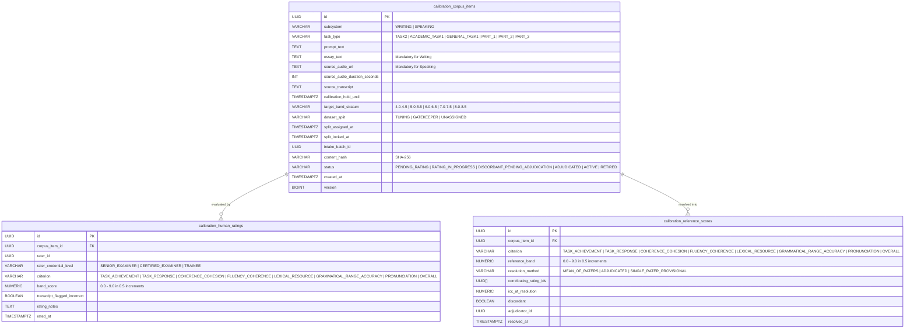
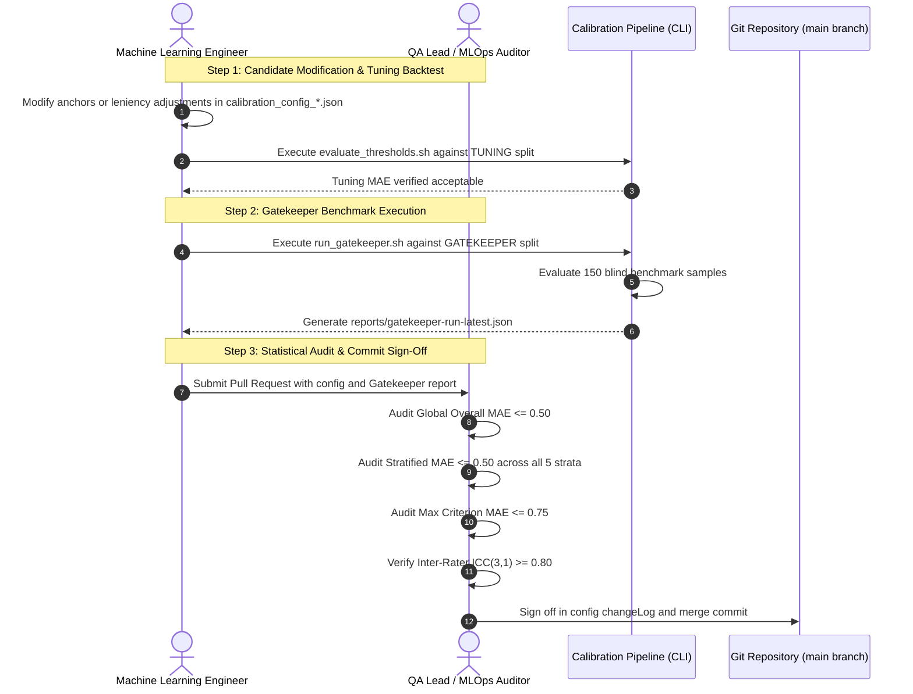

# CALIBRATION_GUIDE.md — ENGONOW Smart LMS

## 1. Calibration Architecture Overview

The ENGONOW Smart LMS scoring ecosystem uses an empirical, closed-loop calibration architecture to guarantee psychometric validity across IELTS Writing and Speaking evaluations. The system combines multi-provider Large Language Models (Google Gemini 2.5 Flash, Groq Llama 3.3 70B, Azure OpenAI GPT-4o) with an Acoustic Digital Signal Processing (DSP) Engine, grounded against a human-adjudicated "Golden Corpus" and monitored in production via Cumulative Sum (CUSUM) Statistical Process Control (SPC).

```mermaid
flowchart TD
    subgraph GoldenCorpus["Golden Corpus Foundation (PostgreSQL)"]
        GCI["calibration_corpus_items\n(Ground-Truth Essays & Audios)"]
        CHR["calibration_human_ratings\n(Dual Blind Examiner Scores)"]
        CRS["calibration_reference_scores\n(Adjudicated Cambridge Consensus)"]
        GCI --> CHR --> CRS
    end

    subgraph ConfigLayer["Calibration & Threshold Governance"]
        CFG["calibration_config_speaking.json / writing.json\n(Anchors, Tolerance & Leniency Adjustments)"]
        CRS -.->|Empirical Fit / Stratified Optimization| CFG
    end

    subgraph RuntimePipeline["Production Inference Subsystem"]
        AUDIO["Student Audio Response"] --> DSP["Acoustic DSP Engine\n(Praat / Kaldi / Wav2Vec2)"]
        DSP --> METRICS["Raw Acoustic Metrics\n(WPM, Phonation, Pauses, Stress)"]
        METRICS & CFG --> ORCH["AcousticOrchestrator\n(Evidence Resolution)"]
        ORCH --> DIAG["acoustic_diagnostics_json\n(Band-Supporting Constraints)"]
        DIAG & ESSAY["Essay / Transcript"] --> PROMPT["Evaluation Prompts\n(speaking_system.txt / writing_system.txt)"]
        PROMPT --> LLM["LLM Evaluation Engine\n(Gemini / Groq / Azure)"]
        LLM --> RESULT["Authoritative Scored Assessment"]
    end

    subgraph VerificationMeters["Offline Gatekeeper & Online Drift Control"]
        GK["Gatekeeper Validation Pipeline\n(scripts/calibration/run_gatekeeper.sh)"]
        CFG & CRS --> GK
        GK --> REPORT["gatekeeper-run-latest.json\n(Overall & Stratified MAE)"]
        RESULT --> CUSUM["Real-Time CUSUM Monitor\n(calibration_cusum_checkpoints)"]
        CUSUM -->|Drift Threshold Breach (h >= 2.50)| HOLD["Automated System Drift Hold\n(calibration_system_flags: drift_hold=true)"]
    end
```

The scoring ecosystem enforces strict separation of concerns among three layers:
1. **Calibration Configurations (`calibration_config_speaking.json`, `calibration_config_writing.json`)**: Managed via `calibration/config_manager.py` with strict Pydantic v2 schemas (`extra="forbid"`), specifying snapshot references, acceptance tolerances, few-shot anchors, post-hoc leniency adjustments, and append-only version ledgers. Acoustic GOP pronunciation thresholds are optimized offline via `telemetry/auto_calibrator.py` into `calibration_config.json`.
2. **LLM Evaluation Prompts (`speaking_system.txt`, `writing_system.txt`)**: System and user prompt templates that ingest structured acoustic diagnostic evidence (`{{acoustic_diagnostics_json}}`). Prompts contain psychometric evaluation rubrics, underlength guardrails (< 20 words $\to$ Band $\le$ 4.0), and Cambridge band definitions to prevent LLM leniency or hallucinations.
3. **Golden Corpus**: Immutably locked dataset splits (`TUNING` and `GATEKEEPER`) representing human examiner consensus. All threshold modifications must be validated offline against the held-out `GATEKEEPER` split before deployment to production.

---

## 2. Threshold Configuration & Schema Specification

### 2.1 JSON Schema Specification (`calibration/config_manager.py`)

Subsystem calibration configurations (`calibration_config_speaking.json` and `calibration_config_writing.json`) conform to the strict Pydantic v2 `CalibrationConfig` model (`extra="forbid"`):

```json
{
  "configVersion": "2026.09.01-v1",
  "subsystem": "SPEAKING",
  "promptTemplateRef": "providers/prompts/speaking_system.txt",
  "geminiModel": "gemini-2.5-flash",
  "corpusSnapshotId": "snap-speaking-20260825-001",
  "acceptanceThresholds": {
    "overallMae": 0.50,
    "maxCriterionMae": 0.75,
    "minRaterPoolIcc": 0.80
  },
  "fewShotAnchors": [
    {
      "criterion": "FLUENCY_COHERENCE",
      "band": 4.0,
      "corpusItemId": "item-speaking-fc-40",
      "rationale": "Frequent noticeable pauses, false starts, and slow speech rate."
    },
    {
      "criterion": "FLUENCY_COHERENCE",
      "band": 8.0,
      "corpusItemId": "item-speaking-fc-80",
      "rationale": "Speaks fluently with only rare repetition or self-correction; coherence is effortless."
    },
    {
      "criterion": "PRONUNCIATION",
      "band": 4.0,
      "corpusItemId": "item-speaking-pr-40",
      "rationale": "Frequent phoneme mispronunciations requiring listener effort."
    },
    {
      "criterion": "PRONUNCIATION",
      "band": 8.0,
      "corpusItemId": "item-speaking-pr-80",
      "rationale": "Uses a wide range of pronunciation features with flexible intonation and rhythm."
    }
  ],
  "criterionLeniencyAdjustment": {
    "FLUENCY_COHERENCE": 0.0,
    "PRONUNCIATION": 0.0
  },
  "gatekeeperEvaluation": {
    "evaluatedAt": "2026-09-04T08:30:00Z",
    "overallMae": 0.3850,
    "maxCriterionMae": 0.4920,
    "result": "PASSED"
  },
  "changeLog": [
    {
      "version": "2026.09.01-v1",
      "timestamp": "2026-08-25T00:00:00Z",
      "author": "Principal MLOps Architect",
      "change": "Initial baseline calibration config for IELTS Speaking Subsystem",
      "gatekeeperMae": 0.3850
    }
  ]
}
```

### 2.2 Acoustic GOP Cutoff Configuration (`calibration_config.json`)

The acoustic engine maintains Goodness-of-Pronunciation (GOP) log-probability thresholds in `calibration_config.json`, generated by `telemetry/auto_calibrator.py` via Differential Evolution optimization against human-labeled pronunciation benchmarks:

```json
{
  "band_4": -1.2581700000512586,
  "band_5": -0.553482277932699,
  "band_6": -0.4046372498148447,
  "band_7": -0.2917108386749076,
  "band_8": -0.1642934144067576,
  "updated_at": "2026-07-31T04:01:02.268729+00:00"
}
```

### 2.3 Dynamic AcousticOrchestrator Evidence Resolution

The `AcousticOrchestrator` runtime (`acoustic/acoustic_orchestrator.py`) extracts objective DSP metrics and packages them for prompt injection:

1. **Acoustic Metrics Extraction**:
   - **Speaking Rate (WPM)**: $\text{WPM} = \frac{\text{Word Count}}{\text{Total Duration (min)}}$
   - **Articulation Rate (WPM)**: $\text{Active WPM} = \frac{\text{Word Count}}{\text{Total Duration} - \text{Silent Pause Duration (min)}}$
   - **Phonation Ratio**: $\text{Phonation Ratio} = \frac{\text{Voiced Phonation Time}}{\text{Total Audio Duration}}$
   - **Cognitive Pause Analysis**: Silent pauses $> 0.75\text{s}$ vs filled pauses (um, uh).
   - **Lexical Stress Accuracy**: CMUdict syllable stress alignment ratio.
   - **Pitch Intonation Pattern**: Fundamental frequency ($F0$) contour variation coefficient and `monotone_flag`.
2. **Prompt Diagnostics Payload Injection**: The resolved vector is serialized into `{{acoustic_diagnostics_json}}` within `providers/prompts/speaking_user.txt`:
   ```json
   {
     "total_duration_seconds": 72.21,
     "speaking_rate_wpm": 109.6,
     "articulation_rate_wpm": 115.2,
     "phonation_ratio": 0.952,
     "silent_cognitive_pause_count": 4,
     "filled_pause_count": 0,
     "stress_accuracy_ratio": 1.0,
     "dominant_contour_pattern": "FLAT",
     "monotone_flag": true,
     "excluded_from_automated_scoring": false,
     "exclusion_reason": null
   }
   ```
3. **Acoustic Exclusion Short-Circuit**: If audio discontinuity or technical clipping exceeds 15% of duration (`excluded_from_automated_scoring = true`), `GeminiSpeakingProvider` short-circuits the pipeline (0 LLM network calls), returns `FC = null` and `PR = null`, and flags `requires_human_review = true`.

---

## 3. Golden Corpus Management (Database & Flyway)

The Golden Corpus is stored in PostgreSQL and governed by Flyway migration [`V6__create_calibration_corpus_tables.sql`](file:///d:/Project%20CV/engonow-lms/src/main/resources/db/migration/V6__create_calibration_corpus_tables.sql).

### 3.1 Relational Schema Architecture



### 3.2 SQL Seeding Specification

#### Writing Corpus Item Seeding
```sql
INSERT INTO calibration_corpus_items (
    id,
    subsystem,
    task_type,
    prompt_text,
    essay_text,
    target_band_stratum,
    dataset_split,
    intake_batch_id,
    content_hash,
    status
) VALUES (
    gen_random_uuid(),
    'WRITING',
    'TASK2',
    'Some people believe that unpaid community service should be a compulsory part of high school programmes. To what extent do you agree or disagree?',
    'In contemporary society, the proposition of incorporating mandatory unpaid community service into high school curriculums has sparked considerable debate. Proponents contend that such initiatives foster civic responsibility and altruism, whereas opponents argue they place an undue burden on students already striving for academic excellence. This essay will examine both perspectives before presenting a reasoned conclusion.',
    '7.0-7.5',
    'UNASSIGNED',
    gen_random_uuid(),
    encode(sha256('In contemporary society, the proposition of incorporating mandatory unpaid community service into high school curriculums...'::bytea), 'hex'),
    'PENDING_RATING'
);
```

#### Speaking Corpus Item Seeding
```sql
INSERT INTO calibration_corpus_items (
    id,
    subsystem,
    task_type,
    prompt_text,
    source_audio_url,
    source_audio_duration_seconds,
    source_transcript,
    target_band_stratum,
    dataset_split,
    intake_batch_id,
    content_hash,
    status
) VALUES (
    gen_random_uuid(),
    'SPEAKING',
    'PART_2',
    'Describe a memorable journey you have taken. You should say where you went, how you travelled, who you went with, and explain why it was memorable.',
    's3://engonow-golden-corpus/audio/speaking/part2/item-spk-20260904-001.mp3',
    118,
    'I would like to talk about a train journey across the central highlands of Vietnam that I took two years ago...',
    '7.0-7.5',
    'UNASSIGNED',
    gen_random_uuid(),
    encode(sha256('s3://engonow-golden-corpus/audio/speaking/part2/item-spk-20260904-001.mp3'::bytea), 'hex'),
    'PENDING_RATING'
);
```

#### Recording Reference Scores (Cambridge Consensus)
```sql
INSERT INTO calibration_reference_scores (
    id,
    corpus_item_id,
    criterion,
    reference_band,
    resolution_method,
    contributing_rating_ids,
    icc_at_resolution,
    discordant
) VALUES (
    gen_random_uuid(),
    'b8c9d0e1-2345-6789-abcd-ef0123456789',
    'FLUENCY_COHERENCE',
    7.0,
    'MEAN_OF_RATERS',
    ARRAY['c1d2e3f4-0001-1111-2222-333344445555'::uuid, 'c1d2e3f4-0002-1111-2222-333344445555'::uuid],
    0.875,
    FALSE
);
```

### 3.3 Bulk Intake Tooling (`scripts/calibration_intake_cli.py`)

The CLI intake tool executes strict schema validation, deduplication (via `content_hash` and unique constraints), and PostgreSQL batch ingestion:

```bash
# 1. Validate dataset JSON format without writing to PostgreSQL (Dry Run)
python scripts/calibration_intake_cli.py \
  --file data/golden_corpus_speaking_batch_04.json \
  --dry-run

# 2. Ingest and execute deduplication against PostgreSQL database
python scripts/calibration_intake_cli.py \
  --file data/golden_corpus_speaking_batch_04.json \
  --db-url "$DATABASE_URL" \
  --batch-id "3fa85f64-5717-4562-b3fc-2c963f66afa6"
```

**CLI Argument Reference:**
- `--file`, `-f` *(Required)*: Path to the JSON fixture file containing calibration items.
- `--db-url`, `-d` *(Optional)*: PostgreSQL connection string (defaults to `DATABASE_URL` or `localhost:5432/engonow_lms`).
- `--batch-id`, `-b` *(Optional)*: Explicit UUID batch identifier. Generates `uuid4()` if omitted.
- `--dry-run` *(Optional)*: Validates domain constraints and JSON structures without performing database writes.

### 3.4 Invariants for Ground-Truth Eligibility

A corpus item is prohibited from being evaluated in Gatekeeper benchmarks until all criteria are fulfilled:
1. **Double-Blind Examiner Rating**: Minimum 2 independent human examiners (`rater_credential_level` in `['CERTIFIED_EXAMINER', 'SENIOR_EXAMINER']`) who rated without visibility into peer scores.
2. **Inter-Rater Reliability Threshold**: Intraclass Correlation Coefficient $ICC(3,1) \ge 0.80$ calculated via Two-Way Mixed Single-Score Consistency ANOVA ([`IccCalculator.java`](file:///d:/Project%20CV/engonow-lms/src/main/java/com/engonow/lms/calibration/util/IccCalculator.java)). If score discrepancy $> 0.5$ bands, item is marked `discordant = TRUE` and must be adjudicated by a `SENIOR_EXAMINER`.
3. **Authoritative Rounding**: Composite `OVERALL` reference band must be calculated using Cambridge standard half-band upward arithmetic via [`providers/rounding.py`](file:///d:/Project%20CV/engonow-lms/providers/rounding.py) and [`apply_cambridge_rounding()`](file:///d:/Project%20CV/engonow-lms/calibration/benchmark_engine.py).
4. **Dataset Split Immutability Lock**: The item must be locked (`dataset_split` in `['TUNING', 'GATEKEEPER']` and `split_locked_at IS NOT NULL`). PostgreSQL trigger `trg_prevent_split_change` blocks updates to `dataset_split` once locked.
5. **Item Status**: Record status must be set to `ACTIVE`.

---

## 4. Executing the Calibration Pipeline (CLI Scripts)

### 4.1 Tuning Backtest (`evaluate_thresholds.sh`)

Iterative threshold tuning is executed against the `TUNING` split. The engineer experiments with prompt anchors and leniency adjustments in `calibration_config_speaking.json` or `calibration_config_writing.json` without contaminating held-out test data:

```bash
# 1. Backtest candidates against Tuning dataset
bash scripts/calibration/run_gatekeeper.sh \
  --subsystem=SPEAKING \
  --split=TUNING \
  --snapshot=snap-speaking-20260825-001 \
  --config=calibration_config_speaking.json \
  --output=reports/tuning-run-candidate.json \
  --markdown=reports/tuning-run-candidate.md

# 2. Evaluate statistical tolerances
bash scripts/calibration/evaluate_thresholds.sh \
  --report=reports/tuning-run-candidate.json \
  --overall-mae-max=0.50 \
  --criterion-mae-max=0.75 \
  --require-per-stratum-pass=true
```

### 4.2 Gatekeeper Verification (`run_gatekeeper.sh`)

The formal Gatekeeper run evaluates the candidate configuration against the held-out `GATEKEEPER` split. This execution generates the immutable release artifact `reports/gatekeeper-run-latest.json`.

```bash
# 1. Precondition Check (Ensures drift_hold == false and rater pool ICC >= 0.80)
bash scripts/calibration/check_preconditions.sh

# 2. Execute official Gatekeeper verification
bash scripts/calibration/run_gatekeeper.sh \
  --subsystem=WRITING \
  --split=GATEKEEPER \
  --snapshot=snap-gatekeeper-v1 \
  --config=calibration_config_writing.json \
  --output=reports/gatekeeper-run-latest.json \
  --markdown=reports/gatekeeper-run-latest.md

# 3. Enforce zero-tolerance production threshold check
bash scripts/calibration/evaluate_thresholds.sh \
  --report=reports/gatekeeper-run-latest.json \
  --overall-mae-max=0.50 \
  --criterion-mae-max=0.75 \
  --require-per-stratum-pass=true
```

### 4.3 Gatekeeper Report Artifact (`gatekeeper-run-latest.json`)

The generated artifact conforms to the `BenchmarkReport` dataclass produced by [`calibration/benchmark_engine.py`](file:///d:/Project%20CV/engonow-lms/calibration/benchmark_engine.py):

```json
{
  "subsystem": "WRITING",
  "dataset_split": "GATEKEEPER",
  "corpus_snapshot_id": "snap-gatekeeper-v1",
  "evaluated_at": "2026-08-26T04:31:35.778948+00:00",
  "total_items": 150,
  "overall_mae": 0.3850,
  "max_criterion_mae": 0.4920,
  "worst_criterion": "COHERENCE_COHESION",
  "criterion_mae": {
    "TASK_RESPONSE": 0.3400,
    "COHERENCE_COHESION": 0.4920,
    "LEXICAL_RESOURCE": 0.3480,
    "GRAMMATICAL_RANGE_ACCURACY": 0.3600
  },
  "per_stratum_metrics": {
    "4.0-4.5": {
      "stratum": "4.0-4.5",
      "item_count": 30,
      "overall_mae": 0.4167,
      "criterion_mae": {
        "TASK_RESPONSE": 0.3800,
        "COHERENCE_COHESION": 0.4500,
        "LEXICAL_RESOURCE": 0.4200,
        "GRAMMATICAL_RANGE_ACCURACY": 0.4167
      },
      "passed": true
    },
    "5.0-5.5": {
      "stratum": "5.0-5.5",
      "item_count": 30,
      "overall_mae": 0.3833,
      "criterion_mae": {
        "TASK_RESPONSE": 0.3500,
        "COHERENCE_COHESION": 0.4200,
        "LEXICAL_RESOURCE": 0.3600,
        "GRAMMATICAL_RANGE_ACCURACY": 0.4033
      },
      "passed": true
    },
    "6.0-6.5": {
      "stratum": "6.0-6.5",
      "item_count": 30,
      "overall_mae": 0.3500,
      "criterion_mae": {
        "TASK_RESPONSE": 0.3200,
        "COHERENCE_COHESION": 0.4000,
        "LEXICAL_RESOURCE": 0.3300,
        "GRAMMATICAL_RANGE_ACCURACY": 0.3500
      },
      "passed": true
    },
    "7.0-7.5": {
      "stratum": "7.0-7.5",
      "item_count": 30,
      "overall_mae": 0.3667,
      "criterion_mae": {
        "TASK_RESPONSE": 0.3400,
        "COHERENCE_COHESION": 0.4100,
        "LEXICAL_RESOURCE": 0.3500,
        "GRAMMATICAL_RANGE_ACCURACY": 0.3667
      },
      "passed": true
    },
    "8.0-8.5": {
      "stratum": "8.0-8.5",
      "item_count": 30,
      "overall_mae": 0.4083,
      "criterion_mae": {
        "TASK_RESPONSE": 0.3900,
        "COHERENCE_COHESION": 0.4400,
        "LEXICAL_RESOURCE": 0.3800,
        "GRAMMATICAL_RANGE_ACCURACY": 0.4233
      },
      "passed": true
    }
  },
  "is_acceptable": true,
  "failure_reasons": [],
  "diagnostics": []
}
```

---

## 5. Statistical Process Control (CUSUM) & Telemetry Drift Monitoring

Production scoring accuracy is continuously monitored via Two-Sided Cumulative Sum (CUSUM) Statistical Process Control ([`telemetry/cusum_detector.py`](file:///d:/Project%20CV/engonow-lms/telemetry/cusum_detector.py) and [`telemetry/cusum_state_manager.py`](file:///d:/Project%20CV/engonow-lms/telemetry/cusum_state_manager.py)).

### 5.1 Two-Sided CUSUM Mathematical Formulation

For each evaluation event $i$ with AI score $y_i$ and human reference band $\hat{y}_i$:
$$\text{Deviation } d_i = |y_i - \hat{y}_i| - \text{Target MAE}$$

1. **Upper Arm $C_i^+$ (Model Accuracy Degradation)**:
   $$C_i^+ = \max(0, C_{i-1}^+ + d_i - k)$$
   - Tracks persistent deterioration where scoring error exceeds target threshold.
   - When $C_i^+ \ge h$, emits `CRITICAL` alert, resets $C_i^+ = 0$, and sets `drift_hold = true`.
2. **Lower Arm $C_i^-$ (Artificial Over-Accuracy / Data Contamination)**:
   $$C_i^- = \max(0, C_{i-1}^- - d_i - k)$$
   - Tracks suspicious zero-error runs or data leakage.
   - When $C_i^- \ge h$, emits `WARNING` alert and resets $C_i^- = 0$.

### 5.2 Mathematical Parameter Invariants
- **Target MAE ($\text{target\_mae}$)**: $0.50$
- **Allowance / Slack ($k$)**: $0.10$
- **Decision Boundary ($h$)**: $2.50$
- **Deduplication TTL**: $7 \text{ days}$ ($604,800 \text{ seconds}$)

### 5.3 State Persistence & System Flags Schema ([`V7__create_cusum_state_and_flags.sql`](file:///d:/Project%20CV/engonow-lms/src/main/resources/db/migration/V7__create_cusum_state_and_flags.sql))

State is maintained in Redis for $< 1\text{ms}$ updates and checkpointed durably to PostgreSQL:
```sql
-- CUSUM Checkpoints table
CREATE TABLE IF NOT EXISTS calibration_cusum_checkpoints (
    subsystem           VARCHAR(20) NOT NULL,
    criterion           VARCHAR(40) NOT NULL,
    c_plus              NUMERIC(8,4) NOT NULL DEFAULT 0.0,
    c_minus             NUMERIC(8,4) NOT NULL DEFAULT 0.0,
    sample_count        BIGINT NOT NULL DEFAULT 0,
    last_updated_at     TIMESTAMPTZ NOT NULL DEFAULT CURRENT_TIMESTAMP,
    last_reset_at       TIMESTAMPTZ,
    PRIMARY KEY (subsystem, criterion)
);

-- System Safety Flags table
CREATE TABLE IF NOT EXISTS calibration_system_flags (
    flag_key            VARCHAR(100) PRIMARY KEY,
    flag_value          BOOLEAN NOT NULL DEFAULT FALSE,
    reason              TEXT,
    updated_at          TIMESTAMPTZ NOT NULL DEFAULT CURRENT_TIMESTAMP
);
```

### 5.4 Drift Hold Recovery & Circuit Breaker Runbook
When $C^+ \ge 2.50$, the system automatically writes `drift_hold = true` to `calibration_system_flags`. While active:
1. `IntelligentProviderSelector` fails over to calibrated secondary providers or marks submissions for human examiner review (`requires_human_review = true`).
2. Release gatekeeper script `check_preconditions.sh` blocks subsequent deployments.
3. **Resolution Procedure**:
   - Inspect recent prompt adjustments or model provider degradation.
   - Re-tune anchors or prompt templates via `evaluate_thresholds.sh`.
   - Clear the drift hold flag via authenticated admin REST API:
     ```bash
     curl -X POST "${LMS_API_URL}/api/v1/admin/calibration/system/flags/drift-hold/reset" \
       -H "Authorization: Bearer ${ADMIN_JWT_TOKEN}" \
       -H "Content-Type: application/json" \
       -d '{"reason": "Recalibrated prompt anchors and validated on gatekeeper snapshot snap-speaking-20260825-001"}'
     ```

---

## 6. QA Sign-Off & Release Governance

Modifications to `calibration_config_speaking.json`, `calibration_config_writing.json`, prompt templates, or provider configurations require formal QA sign-off through a mandatory 3-step audit process.



### Step 1: Candidate Modification & Tuning Backtest
1. The engineer creates a candidate feature branch: `feature/calibration-speaking-q3`.
2. Edit target prompt anchors or leniency adjustments in `calibration_config_speaking.json`.
3. Backtest candidates exclusively against the `TUNING` split using `run_gatekeeper.sh --split=TUNING`.
4. Iterate until Tuning Overall MAE $\le 0.45$.

### Step 2: Run Gatekeeper Verification
1. Execute the production Gatekeeper benchmark against the locked `GATEKEEPER` split snapshot:
   ```bash
   bash scripts/calibration/run_gatekeeper.sh \
     --subsystem=SPEAKING \
     --split=GATEKEEPER \
     --snapshot="$(jq -r .corpusSnapshotId calibration_config_speaking.json)" \
     --config=calibration_config_speaking.json \
     --output=reports/gatekeeper-run-latest.json
   ```
2. Verify exit status (`echo $?` == 0). The report `reports/gatekeeper-run-latest.json` is generated directly by the engine and must never be edited manually.

### Step 3: Review Mean Absolute Error (MAE) & Commit Sign-Off
The QA Lead conducts an independent audit of `gatekeeper-run-latest.json` against the hard statistical acceptance criteria:

| Statistical Metric | Acceptance Threshold | Description / Action on Breach |
|---|---|---|
| **Global Overall Band MAE** | $\le 0.5000$ | Overall Band score deviation against Cambridge human consensus across all evaluation samples. |
| **Stratified MAE (All 5 Strata)** | $\le 0.5000$ each | Independent MAE check for strata `4.0-4.5`, `5.0-5.5`, `6.0-6.5`, `7.0-7.5`, and `8.0-8.5`. Failure in any single stratum blocks deployment. |
| **Max Criterion MAE** | $\le 0.7500$ | Worst-performing individual criterion (e.g. Fluency, Pronunciation, Lexical, Grammar). |
| **Rater Pool Reliability** | $ICC(3,1) \ge 0.80$ | Two-Way Mixed Single-Score Consistency Intraclass Correlation Coefficient of human raters. |

#### Approval & Merge Execution
1. If any metric breaches tolerance, the QA Lead rejects the pull request.
2. If all metrics pass, the QA Lead signs off on the release:
   - Increment `configVersion` in `calibration_config_speaking.json` / `calibration_config_writing.json`.
   - Update `gatekeeperEvaluation` block with the audited metrics and set `"result": "PASSED"`.
   - Append an entry to `changeLog` documenting author, QA reviewer, Gatekeeper run ID, and reason for adjustment.
   - Attach `reports/gatekeeper-run-latest.json` and `reports/gatekeeper-run-latest.md` to the pull request.
3. Separation of Duties: The engineer authoring the threshold adjustment and the QA Lead approving the pull request must be separate individuals. Merging a threshold modification without an attached, passing Gatekeeper run artifact constitutes a critical governance violation.
