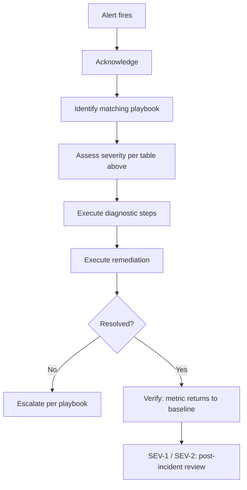

# RUNBOOK.md — ENGONOW Smart LMS

## 1. Incident Management Overview

| Severity | Definition | Response SLA | Examples |
|---|---|---|---|
| SEV-1 | Complete loss of a critical capability; no automated fallback remains | Immediate page, all-hands | All AI providers circuit-OPEN; database unreachable |
| SEV-2 | Degraded capability with a working fallback, or a data-integrity risk not yet user-facing | Page on-call, respond within 30 min | Single provider OPEN with failover active; CUSUM drift alert; Outbox backlog growing |
| SEV-3 | Isolated, non-blocking, or cosmetic issue | Business-hours triage, no page | Single-instance metric gap; dashboard rendering issue |

**Triage workflow:**



A severity assignment is never downgraded solely because a fallback exists — a fallback masks user impact, it does not eliminate operational risk. Re-assess severity if a fallback itself later fails.

---

## Playbook 1: AI Provider Circuit Breaker `OPEN` — Failover Exhaustion

**Severity:** SEV-1 when all three providers (Gemini, Groq, Azure OpenAI) are simultaneously `OPEN`. SEV-2 when one or two providers are `OPEN` and at least one `CLOSED`/`HALF_OPEN` provider remains available for routing.

**Scenario:** Gemini, Groq, and Azure OpenAI all fail or rate-limit requests; the Provider Selector has no `CLOSED`-state candidate to route to.

**Symptoms:**
- `GET /health` returns `"status": "DOWN"` with every entry under `components.aiProviders` reporting `"OPEN"`.
- New submissions remain in `PROCESSING` past the expected evaluation latency, or transition directly to `FAILED`.
- AI Worker logs show repeated `ALL_PROVIDERS_UNAVAILABLE` errors.

**Diagnostic Steps:**
1. Confirm breaker state directly:
   ```promql
   sum by (provider_id, state) (circuit_breaker_state_info)
   ```
2. Identify the triggering failure signal per provider:
   ```promql
   sum(rate(gemini_api_request_total{status_code=~"429|503"}[5m])) by (provider_id)
   ```
   `429` indicates rate-limit/quota exhaustion (hard-trip signal); `503` indicates a provider-side outage.
3. Check each provider's own public status page to distinguish a self-inflicted quota issue from a genuine vendor outage.
4. Check `ai.call.latency{outcome="timeout"}` — a spike here without a corresponding 429/503 spike indicates a network-path issue rather than provider-side failure.

**Remediation:**
- **Quota exhaustion (429, single or all providers):** rotate to a backup API key with unconsumed quota if one is provisioned; if not, request a temporary quota increase through the provider's console — this is not instantaneous, plan for the degraded-mode step below regardless.
- **Self-imposed throttling misconfigured too aggressively:** adjust the token/request-rate limit configuration for the affected provider and confirm the breaker transitions out of `OPEN` on its next scheduled Half-Open probe.
- **All providers exhausted simultaneously (SEV-1):** engage degraded mode — set the `ai_evaluation_paused` flag. Submissions continue to be accepted and persist in `PENDING` with a "queued, evaluation temporarily delayed" status shown to the student, rather than transitioning to `FAILED`. This avoids data loss and requires no student resubmission once any provider circuit closes.

**Escalation:** Page Backend on-call immediately for SEV-1. If a vendor-side outage is confirmed (Step 3), no remediation exists on our side beyond degraded mode — notify the on-call lead and prepare a status-page update for an extended-duration incident.

---

## Playbook 2: CUSUM Scoring Drift Alerts (`C+` Upper Arm / `C-` Lower Arm)

**Severity:** SEV-1 for a `C+` (upper arm) trigger — active scoring degradation is a direct, ongoing user-facing correctness issue. SEV-2 for a `C-` (lower arm) trigger — a leading indicator requiring investigation, not yet confirmed user-facing harm.

**Scenario:** The CUSUM statistical process control monitor detects the AI is consistently scoring too strictly (`C-`, sustained error below the 0.5 MAE target — see the contamination-risk framing below) or too leniently / inaccurately (`C+`, sustained error above target) relative to the Golden Corpus reference.

**Diagnostic Steps:**
1. Query current state directly:
   ```sql
   SELECT subsystem, criterion, c_plus, c_minus, sample_count, last_updated_at
   FROM cusum_state
   WHERE c_plus > 2.5 OR c_minus > 2.5;
   ```
2. Open Grafana Dashboard 2 (MAE & Scoring Drift) for the flagged `subsystem`/`criterion` to see the trend leading into the trigger, not just the instantaneous value.
3. **For `C+`:** cross-reference the timestamp range against Playbook 1's circuit-breaker history — a `C+` trigger that correlates with a period of fallback-provider routing (Groq/Azure serving traffic while Gemini was `OPEN`) may indicate the fallback provider's own MAE was never independently Gatekeeper-validated, which is an expected, not anomalous, finding (`ARCHITECTURE_GUIDE.md` Section 4.2).
4. **For `C-`:** check recent commits/PRs to `prompts/` or `calibration_config_*.json` for any reference to Gatekeeper-split corpus item IDs, and check the calibration sampling job's logs for any indication of comparing a value against itself (a stale-cache or self-comparison defect).

**Remediation:**
- Automated hold: a `C+` `CRITICAL` trigger already sets `drift_hold` automatically (Sprint 3 design) — confirm it is set; do not manually clear it until Step 3/4 investigation above is complete.
- Route new submissions for the affected `subsystem`/`criterion` to the human-examiner review queue until the drift is resolved.
- Trigger a fresh, formal Gatekeeper evaluation run against the current corpus snapshot to get an authoritative, up-to-date MAE reading — this is the first automatable step of the recalibration workflow.
- If the Gatekeeper run confirms genuine degradation, proceed to the human-driven 3-step prompt tuning loop; this step is deliberately not automated — a scoring-rubric change is a pedagogical decision, not one to make algorithmically.

**Escalation:** Platform Admin for the Gatekeeper re-run and drift-hold management. Escalate to the Academic Board if the confirmed drift indicates the underlying severity thresholds or rubric calibration itself needs revision, not just a prompt-wording fix.

---

## Playbook 3: Outbox Event Relay Backlog Growth

**Severity:** SEV-2, escalating to SEV-1 if the backlog age exceeds 30 minutes or disk utilization on the `postgres` volume approaches capacity.

**Scenario:** The `outbox_events` table grows because rows are not being successfully relayed to Kafka.

**Symptoms:**
- `outbox_unpublished_count` rising without recovering.
- `outbox_oldest_unpublished_age_seconds` exceeding 300s.

**Diagnostic Steps:**
1. Check `OutboxRelayScheduler` application logs for repeated publish exceptions.
2. Check Kafka broker connectivity from the `lms-core` container:
   ```bash
   docker compose -f docker-compose.prod.yml exec lms-core \
     nc -zv kafka 9092
   ```
3. Confirm the scheduler thread itself is alive (not merely that the application process is running) — a hung scheduled task can leave the application otherwise healthy while the relay loop has silently stopped.
4. Check for schema compatibility rejections at Schema Registry if the relay logs show serialization errors rather than connectivity errors.

**Remediation:**
- **Scheduler hung, Kafka reachable:** restart the `lms-core` container — the `OutboxRelayScheduler` reinitializes on startup and resumes from the oldest unpublished row.
- **Kafka unreachable:** resolve broker connectivity/availability first; the relay will drain the accumulated backlog automatically once connectivity restores — no manual replay needed for rows still in `outbox_events`, since publication was never attempted.
- **Messages already routed to DLQ during the incident:** once the root cause is fixed, dispatch DLQ messages via the Admin Replay API:
  ```bash
  curl -X POST http://localhost:8080/api/v1/admin/dlq/replay \
    -H "Authorization: Bearer $ADMIN_TOKEN" \
    -H "Content-Type: application/json" \
    -d '{"topic": "writing.submission.created.dlq", "maxMessages": 500}'
  ```

**Escalation:** Backend on-call for scheduler/application-level causes. Escalate to infrastructure/platform team if Kafka broker unavailability is confirmed at the infrastructure level rather than a network-path issue between containers.

---

## Playbook 4: SSE Event Dropouts / Redis Pub/Sub Failures

**Severity:** SEV-2. Never SEV-1 by design — the plain `GET /result` endpoint remains authoritative and unaffected regardless of SSE state (`ARCHITECTURE_GUIDE.md` Section 4.3), so this incident degrades real-time UX without blocking a student from ever retrieving a completed result.

**Scenario:** Frontend clients connected to `/events` receive no real-time update when a submission transitions to `SCORED`, despite the transition having actually occurred.

**Diagnostic Steps:**
1. Verify Redis Pub/Sub is actually receiving publishes and has active subscribers for the affected submission:
   ```bash
   redis-cli -a "$REDIS_PASSWORD" PUBSUB CHANNELS 'sse:writing:*'
   redis-cli -a "$REDIS_PASSWORD" PUBSUB NUMSUB "sse:writing:<submissionId>"
   ```
   Zero subscribers on a channel that should have an open browser connection indicates the `lms-core` instance holding that connection failed to subscribe, or dropped the subscription without the client being informed.
2. Check reverse-proxy buffering configuration — Nginx buffers upstream responses by default, which silently breaks SSE streaming (the client receives nothing until the buffer flushes or the connection closes):
   ```nginx
   location /api/v1/ {
       proxy_buffering off;
       proxy_read_timeout 3600s;
       proxy_set_header Connection '';
       chunked_transfer_encoding off;
   }
   ```
3. Confirm the 25-second heartbeat is actually being emitted on the stream (prevents idle-connection timeout at any intermediary):
   ```bash
   curl -N -H "Authorization: Bearer $TEST_TOKEN" \
     http://localhost:8080/api/v1/writing-submissions/<id>/events
   # expect a ": heartbeat" comment line approximately every 25 seconds
   ```
   Absence of the heartbeat indicates the `RealtimeDeliveryService` instance handling that connection has hung.

**Remediation:**
- **Missing heartbeats / hung delivery service:** restart the affected `RealtimeDeliveryService` instance(s). Existing open connections will drop and reconnect automatically (browser-native `EventSource` retry), and reconnection immediately replays current status from PostgreSQL per the established reconnect-correctness design — no missed terminal state.
- **Proxy buffering misconfigured:** apply the Nginx configuration above and reload (`nginx -s reload`), no application restart required.
- **Redis connectivity issue from `lms-core`:** verify `REDIS_HOST`/`REDIS_PASSWORD` resolve and authenticate correctly from within the container network; restart affected instances after connectivity is restored.

**Escalation:** Joint Backend/Frontend on-call — Frontend to confirm actual student-facing impact scope (client library reconnect behavior can mask or worsen the symptom depending on implementation), Backend for the service/proxy-level fix. Escalate to infrastructure if the proxy layer is managed outside the application repository.
